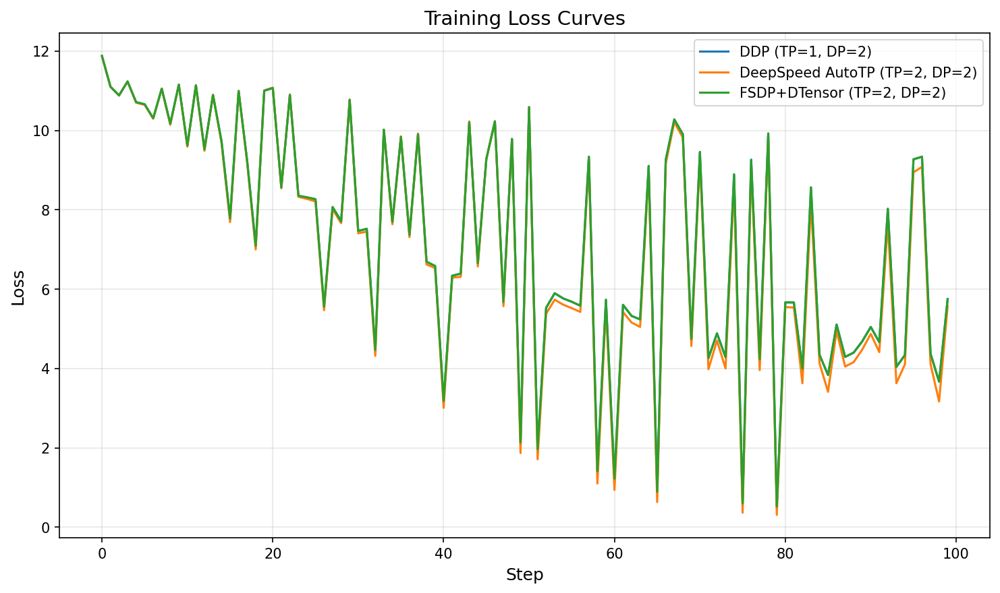

# Ray Train + Tensor Parallelism

Training examples combining Ray Train with tensor parallelism using either DeepSpeed AutoTP or PyTorch native FSDP2+DTensor.

## Features

- **2D Parallelism**: Combine tensor parallelism (TP) with data parallelism (DP)
- **Ray Train Integration**: Distributed execution, checkpointing, and fault tolerance
- **Two Implementations**:
  - `train_deepspeed.py`: DeepSpeed AutoTP with ZeRO optimization
  - `train_fsdp.py`: PyTorch native FSDP2 + DTensor

## Quick Start

```bash
# DeepSpeed AutoTP: 4 GPUs with 2-way TP, 2-way DP
python train_deepspeed.py \
    --model_name Qwen/Qwen2-7B \
    --tp_size 2 \
    --dp_size 2 \
    --num_workers 4 \
    --num_epochs 3

# FSDP+DTensor: 4 GPUs with 2-way TP, 2-way DP
python train_fsdp.py \
    --model_name Qwen/Qwen2-7B \
    --tp_size 2 \
    --dp_size 2 \
    --num_workers 4 \
    --num_epochs 3
```

## Common Arguments

| Argument | Description | Default |
|----------|-------------|---------|
| `--model_name` | HuggingFace model name | `Qwen/Qwen2-7B` |
| `--tp_size` | Tensor parallel degree | Required |
| `--dp_size` | Data parallel degree | `1` |
| `--num_workers` | Total workers (must equal tp_size * dp_size) | Required |
| `--batch_size` | Per-GPU micro batch size | `1` |
| `--seq_length` | Maximum sequence length | `2048` |
| `--num_epochs` | Number of training epochs | `3` |
| `--learning_rate` | Learning rate | `1e-5` |
| `--dataset_name` | HuggingFace dataset | `wikitext` |
| `--storage_path` | Checkpoint storage path | `/mnt/cluster_storage` |
| `--resume_from` | Experiment name to resume from | None |

### DeepSpeed-specific

| Argument | Description | Default |
|----------|-------------|---------|
| `--zero_stage` | ZeRO optimization stage (0-2) | `1` |

Note: Autocast is always enabled for bf16/fp16 dtypes in the FSDP path.

## Anyscale Job Configs

Pre-configured job files are provided for running on Anyscale:

```bash
# DeepSpeed AutoTP
anyscale job submit -f job_deepspeed.yaml

# FSDP + DTensor
anyscale job submit -f job_fsdp.yaml
```

### Common Settings

Both jobs share these configurations:

| Setting | Value | Description |
|---------|-------|-------------|
| `model_name` | `Qwen/Qwen2.5-0.5B` | Small model for testing |
| `tp_size` | 2 | Tensor parallel degree (must divide num_key_value_heads) |
| `dp_size` | 2 | Data parallel degree |
| `num_workers` | 4 | Total GPUs (tp_size × dp_size) |
| `seq_length` | 1024 | Sequence length |
| `batch_size` | 2 | Per-GPU micro batch size |
| `dataset_percentage` | 1.0 | Use 1% of dataset for quick testing |
| `num_epochs` | 1 | Number of training epochs |
| `log_interval` | 1 | Log every step |
| `image_uri` | `anyscale/ray:2.53.0-slim-py312-cu128` | Ray image with CUDA 12.8 |
| `instance_type` | `g4dn.12xlarge` | 4x T4 GPUs per node |
| `num_nodes` | 1 | Single node |

### DeepSpeed-specific Settings (`job_deepspeed.yaml`)

| Setting | Value | Description |
|---------|-------|-------------|
| `zero_stage` | 1 | DeepSpeed ZeRO optimization stage (0-2) |

Requirements: `torch>=2.9.1`, `deepspeed>=0.18.3`, `transformers>=4.45.0`, `datasets>=3.0.0`, `accelerate>=1.0.0`

### FSDP-specific Settings (`job_fsdp.yaml`)

Autocast is always enabled for bf16/fp16 dtypes.

Requirements: `torch>=2.9.1`, `transformers>=4.45.0`, `datasets>=3.0.0`, `accelerate>=1.0.0`

### Customizing Job Configs

Override settings via command line:

```bash
# Use larger model with more GPUs
anyscale job submit -f job_deepspeed.yaml \
  --entrypoint "python train_deepspeed.py --model_name Qwen/Qwen2-7B --tp_size 4 --dp_size 2 --num_workers 8"
```

**Important**: `tp_size` must evenly divide the model's `num_key_value_heads`. For Qwen2.5-0.5B (2 KV heads), valid values are 1 or 2.

## File Structure

```
train_tensor_parallel/
├── train_deepspeed.py     # DeepSpeed AutoTP entry point
├── train_fsdp.py          # FSDP+DTensor entry point
├── common.py              # Shared utilities (training loop, checkpointing)
├── autotp_strategy.py     # DeepSpeed AutoTP strategy
├── fsdp_strategy.py       # FSDP2+DTensor strategy
├── model_builder.py       # Model creation utilities
├── data.py                # TP-aware data loading
├── job_deepspeed.yaml     # Anyscale job config for DeepSpeed
└── job_fsdp.yaml          # Anyscale job config for FSDP
```

## How 2D Parallelism Works

With `tp_size=2` and `dp_size=2` on 4 GPUs:

```
Device Mesh (2x2):
        TP Dim
      [0]  [1]
DP   ┌───┬───┐
Dim  │ 0 │ 1 │  ← TP Group 0 (same data, sharded model)
     ├───┼───┤
     │ 2 │ 3 │  ← TP Group 1 (same data, sharded model)
     └───┴───┘
       ↑   ↑
      DP Groups (different data, gradient sync)
```

- **TP Groups** (rows): GPUs 0,1 and GPUs 2,3 share the same input data but have sharded model weights
- **DP Groups** (columns): GPUs 0,2 and GPUs 1,3 see different data and synchronize gradients

## Key Implementation Details

### TP-Aware Data Loading

Standard data loaders shard by `world_rank`, giving each GPU different data. With tensor parallelism, all GPUs in a TP group must see identical data. The `data.py` module handles this by sharding based on `dp_rank` instead:

```python
# All TP ranks in same DP group get identical batches
sampler = DistributedSampler(
    dataset,
    num_replicas=dp_size,  # NOT world_size
    rank=dp_rank,          # NOT world_rank
)
```

### Checkpointing

All workers save their model shards independently. Ray Train aggregates these into a single checkpoint that can be used for resuming training.

## Verification

This section describes how to verify the correctness of the three distributed training implementations (DDP, DeepSpeed AutoTP, FSDP+DTensor).

### Overview

For a fair comparison, all implementations must start from **identical initial weights**. The training scripts support this via:
- `--init_weights_path`: Path to load/save initial model weights
- `--save_init_weights`: Save initial weights before training (DDP only)

### Prerequisites

- 4 GPUs (for TP=2, DP=2 configuration)
- Model: `Qwen/Qwen2.5-0.5B` (or any compatible model)
- Python environment with PyTorch, DeepSpeed, and Ray Train installed

### Quick Start

```bash
# Create output directories
mkdir -p /tmp/shared_weights /tmp/loss_curves

# Run all three implementations with shared weights
./run_verification_main.sh
```

### Expected Results

When using shared initial weights, you should see:

#### Initial Loss
All three implementations should have **nearly identical initial loss** (difference < 0.001):
```
DDP:       Initial=10.8732
DeepSpeed: Initial=10.8736
FSDP:      Initial=10.8736
```

#### Loss Curve Matching

| Implementation | Max Diff from DDP | Mean Diff | Notes |
|----------------|-------------------|-----------|-------|
| FSDP+DTensor | < 0.02 | < 0.001 | Almost identical to DDP |
| DeepSpeed AutoTP | < 0.5 | < 0.15 | Slightly different due to gradient clipping |

#### Example Output
```
============================================================
LOSS CURVE STATISTICS
============================================================

DDP (TP=1, DP=2):
  Initial loss: 10.873175
  Final loss:   4.644855
  Min loss:     0.723590
  Mean loss:    7.341280

DeepSpeed AutoTP (TP=2, DP=2):
  Initial loss: 10.873634
  Final loss:   4.424264
  Min loss:     0.475180
  Mean loss:    7.223806

FSDP+DTensor (TP=2, DP=2):
  Initial loss: 10.873634
  Final loss:   4.644554
  Min loss:     0.723624
  Mean loss:    7.341585
```

#### Verification Plot


